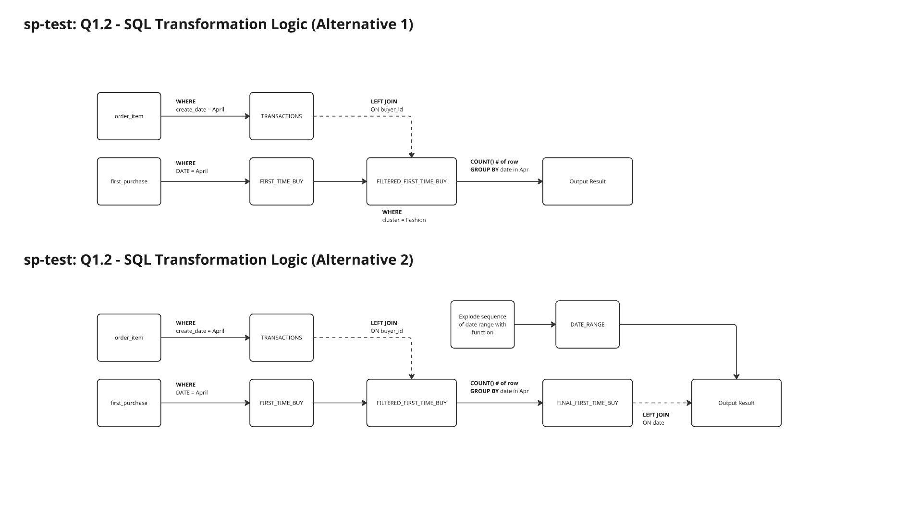
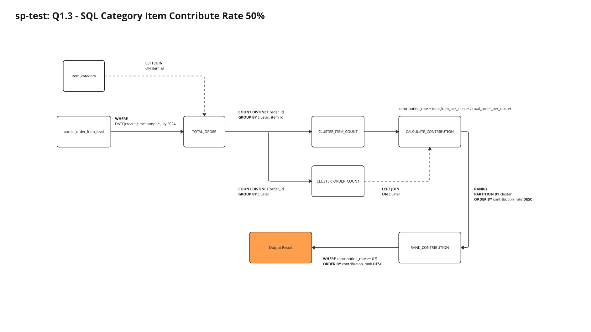
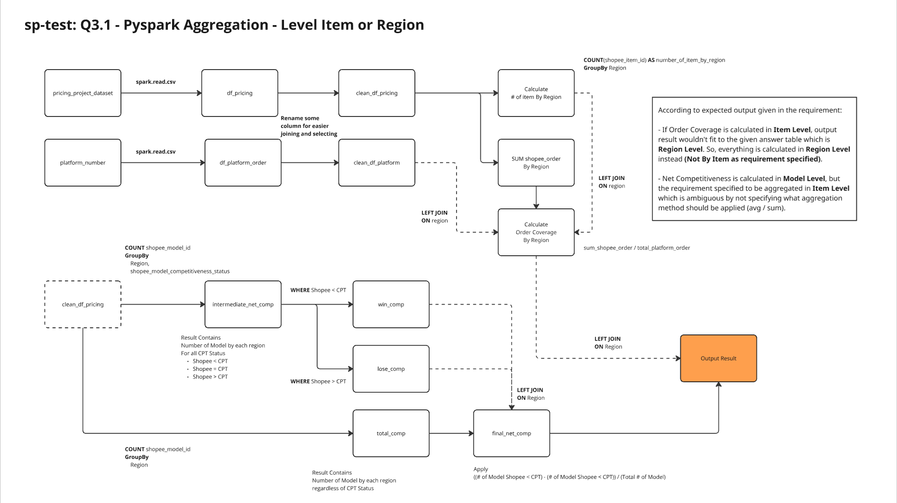
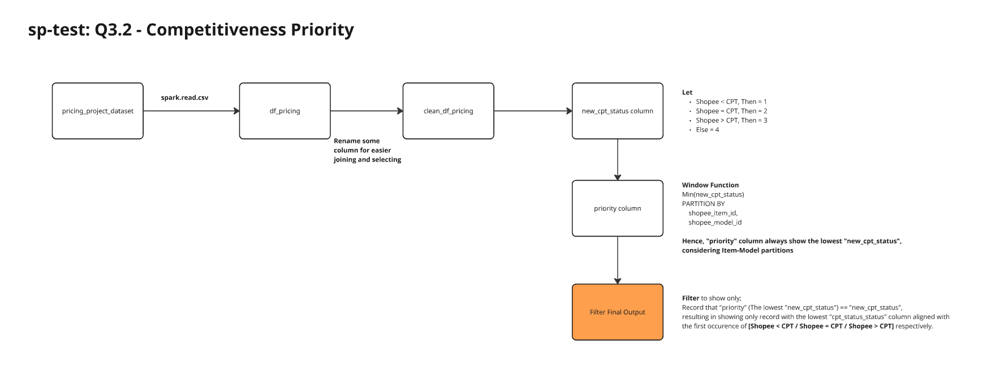

# sp-test

*Patcharanat P.*

*There's notebook workspace at: [03_Python script_Patcharanat.ipynb](03_Python%20script_Patcharanat.ipynb), if output observation is required*

## Table of Contents

- [Project Installation](#project-installation)
- [Data initialization](#data-initialization)
- [01-SQL](#01-sql)
    - [Q1.1: Simple SQL Aggregation](#q11-simple-sql-aggregation)
    - [Q1.2: First Time Purchase Count in a Month](#q12-first-time-purchase-count-in-a-month)
    - [Q1.3: SQL Category Item Contribute Rate 50%](#q13-sql-category-item-contribute-rate-50)
    - [Q1.4: Skipped](#q14-skipped)
- [02-Excel](#02-excel)
- [03-Pyspark](#03-pyspark)
    - [Q3.1: Pyspark Aggregation - Level Item or Region](#q31-pyspark-aggregation---level-item-or-region)
    - [Q3.2: Competitiveness Priority](#q32-competitiveness-priority)
    - [Q3.3: Count Item for Highest Model Ordered Tops 30%](#q33-count-item-for-highest-model-ordered-tops-30)
    - [Q3.4: Dashboard and Presentation](#q34-dashboard-and-presentation)
    - [Q3.5: Extra Tops 30% Flag](#q35-extra-tops-30-flag)
- [Reference](#reference)

## Project Installation

```bash
python -m venv venv

source venv/Scripts/activate

make install
```

*Note: Java and Spark installed on local host machine is required*

## Data Initialization

To read the given excel data with `pyspark`, there's some overhead of dependencies management by managing **jars** file.

To simplify this step, I use pandas to extract data from excel with more minimal dependencies such as `pandas`, and `openpyxl` and load it as simple csv file for futher processing with pyspark.

## 01-SQL

### Q1.1: Simple SQL Aggregation

```sql
SELECT
  candidate_id,
  COUNT(*) AS count_duplicated
FROM
  `shopee.test_candidate_03`
GROUP BY
  candidate_id
HAVING
  count_duplicated > 1
ORDER BY
  candidate_id
```

***Output:***

|candidate_id|count_duplicated|
|:----------:|:--------------:|
|1113|2|
|1116|2|
|1117|2|


### Q1.2: First Time Purchase Count in a Month



1. Alternative 1, in case we need just available data to be shown.
```sql
WITH
TRANSACTIONS AS (
    SELECT
        buyer_id,
        DATE(create_datetime) AS dt,
        cluster_orders_item
    FROM 
        order_item
    WHERE
        DATE(create_datetime) BETWEEN "2021-04-01" AND "2021-04-30"
),

FIRST_TIME_BUY AS (
    SELECT
        buyer_id,
        DATE(result_first_purchase_time) AS dt
    FROM
        first_purchase
    WHERE
        DATE(result_first_purchase_time) BETWEEN "2021-04-01" AND "2021-04-30"
    
),

FILTERED_FIRST_TIME_BUY AS (
    SELECT
        FIRST_TIME_BUY.dt AS dt,
        FIRST_TIME_BUY.buyer_id AS buyer_id
    FROM
        FIRST_TIME_BUY
    LEFT JOIN
        TRANSACTIONS
        ON
            FIRST_TIME_BUY.buyer_id = TRANSACTIONS.buyer_id
    WHERE
        cluster_orders_item = "Fashion"
)

SELECT
    dt AS create_date,
    COUNT(*) AS num_of_first_purchase_buyers
FROM
   FILTERED_FIRST_TIME_BUY
GROUP BY
    dt
ORDER BY
    dt ASC
```

***Output:***

|create_date|num_of_first_purchase_buyers|
|:---------:|:--------------------------:|
| 2021-04-13|                           1|
| 2021-04-15|                           2|
| 2021-04-25|                           1|

2. Alternative 2, in case we need all date to be specified explicitly.

```sql
WITH
TRANSACTIONS AS (
    SELECT
        buyer_id,
        DATE(create_datetime) AS dt,
        cluster_orders_item
    FROM 
        order_item
    WHERE
        DATE(create_datetime) BETWEEN "2021-04-01" AND "2021-04-30"
),

FIRST_TIME_BUY AS (
    SELECT
        buyer_id,
        DATE(result_first_purchase_time) AS dt
    FROM
        first_purchase
    WHERE
        DATE(result_first_purchase_time) BETWEEN "2021-04-01" AND "2021-04-30"
    
),

FILTERED_FIRST_TIME_BUY AS (
    SELECT
        FIRST_TIME_BUY.dt AS dt,
        FIRST_TIME_BUY.buyer_id AS buyer_id
    FROM
        FIRST_TIME_BUY
    LEFT JOIN
        TRANSACTIONS
        ON
            FIRST_TIME_BUY.buyer_id = TRANSACTIONS.buyer_id
    WHERE
        cluster_orders_item = "Fashion"
),

FINAL_FIRST_TIME_BUY AS (
    SELECT
        dt,
        COUNT(*) AS num_of_first_purchase_buyers
    FROM
        FILTERED_FIRST_TIME_BUY
    GROUP BY
        dt
),

DATE_RANGE AS (
    SELECT
        EXPLODE(SEQUENCE(TO_DATE('2021-04-01'), 
        TO_DATE('2021-04-30'), INTERVAL 1 DAY)) AS create_date
)

SELECT
    create_date,
    COALESCE(num_of_first_purchase_buyers, 0) AS num_of_first_purchase_buyers
FROM
    DATE_RANGE
LEFT JOIN
    FINAL_FIRST_TIME_BUY
    ON
    DATE_RANGE.create_date = FINAL_FIRST_TIME_BUY.dt
ORDER BY
    create_date ASC
```

***Output:***

|create_date|num_of_first_purchase_buyers|
|:---------:|:--------------------------:|
| 2021-04-01|                           0|
| 2021-04-02|                           0|
| 2021-04-03|                           0|
| 2021-04-04|                           0|
| 2021-04-05|                           0|
...
| 2021-04-11|                           0|
| 2021-04-12|                           0|
| 2021-04-13|                           1|
| 2021-04-14|                           0|
| 2021-04-15|                           2|
| 2021-04-16|                           0|
...
| 2021-04-29|                           0|
| 2021-04-30|                           0|

### Q1.3: SQL Category Item Contribute Rate 50% 



```sql
WITH
TOTAL_ORDER AS (
    SELECT 
        partial_order_item_level.order_id,
        partial_order_item_level.item_id,
        DATE(partial_order_item_level.create_timestamp) AS create_date,
        item_category.cluster
    FROM
        partial_order_item_level
    LEFT JOIN
        item_category
        ON
            partial_order_item_level.item_id = item_category.item_id
    WHERE
        DATE(partial_order_item_level.create_timestamp) BETWEEN "2024-07-01" AND "2024-07-31"
),

CLUSTER_ITEM_COUNT AS (
    SELECT
        cluster,
        item_id,
        COUNT(DISTINCT order_id) AS total_item_per_cluster
    FROM
        TOTAL_ORDER
    GROUP BY
        cluster, item_id
),

CLUSTER_ORDER_COUNT AS (
    SELECT
        cluster,
        COUNT(DISTINCT order_id) AS total_order_per_cluster
    FROM
        TOTAL_ORDER
    GROUP BY
        cluster
),

CALCULATE_CONTRIBUTION AS (
    SELECT
        CLUSTER_ITEM_COUNT.cluster,
        item_id,
        CLUSTER_ITEM_COUNT.total_item_per_cluster,
        CLUSTER_ORDER_COUNT.total_order_per_cluster,
        CLUSTER_ITEM_COUNT.total_item_per_cluster / CLUSTER_ORDER_COUNT.total_order_per_cluster AS contribution_rate
    FROM
        CLUSTER_ITEM_COUNT
    LEFT JOIN
        CLUSTER_ORDER_COUNT
        ON
            CLUSTER_ITEM_COUNT.cluster = CLUSTER_ORDER_COUNT.cluster 
),

RANK_CONTRIBUTION AS (
    SELECT
        *,
        RANK() OVER (PARTITION BY cluster ORDER BY contribution_rate DESC) AS contribution_rank
    FROM
        CALCULATE_CONTRIBUTION
)

SELECT
    item_id,
    cluster
FROM
    RANK_CONTRIBUTION
WHERE
    contribution_rate >= 0.5
ORDER BY
    cluster, contribution_rank DESC
```

***Output:***

*Not Available*

### Q1.4: Skipped

*skipped*

## 02-EXCEL

*Answers provided in the excel file*

## 03-Pyspark

*There's jupyter notebook workspace at: [03_Python script_Patcharanat.ipynb](03_Python%20script_Patcharanat.ipynb), if output observation is required*

### Q3.1: Pyspark Aggregation - Level Item or Region



```bash
python ./spark_code/q1.py
# check result from terminal
```
***Output:***

|region|order_coverage_by_region|net_competitiveness|number_of_item_by_region|
|:----:|:----------------------:|:-----------------:|:----------------------:|
|    ID|                0.546299|           0.001898|                    8428|
|    MY|                0.623496|           0.002833|                    2118|
|    PH|                0.516156|           0.002469|                    2025|
|    SG|                0.417392|          -0.061531|                    2194|
|    TH|                0.400668|           0.005801|                    4137|
|    VN|                0.516903|          -0.012876|                    2097|

### Q3.2: Competitiveness Priority



```bash
python ./spark_code/q2.py
# check result from terminal
```

***Output:***

|shopee_item_id|shopee_model_id|shopee_model_competitiveness_status|
|:------------:|:-------------:|:---------------------------------:|
|        580861|     9019764370|                       Shopee > CPT|
|       1323167|     6397942095|                       Shopee < CPT|
|       1837669|     8342684624|                       Shopee < CPT|
|       2650112|     7803527018|                       Shopee < CPT|
|       2666411|     3127858767|                       Shopee < CPT|
|       2794532|     8859393605|                       Shopee < CPT|
|       2996790|     7322469724|                       Shopee > CPT|
|       3202936|     8829997338|                       Shopee < CPT|
|       3239333|      747032931|                       Shopee > CPT|
|       3375995|     5926043907|                       Shopee > CPT|

*only showing top 10 rows*

### Q3.3: Count Item for Highest Model Ordered Tops 30%

```bash
python ./spark_code/q3.py
# check result from terminal
```

***Output:***

|region|number_of_item_tops_30|
|:----:|:--------------------:|
|    ID|                  8382|
|    MY|                  2111|
|    SG|                  2186|
|    PH|                  2012|
|    TH|                  4111|
|    VN|                  2088|

### Q3.4: Dashboard and Presentation

*Answer provided through GG slide*

### Q3.5: Extra Tops 30% Flag

```bash
python ./spark_code/q5.py
# check result from terminal
```

***Output:***

|region|shopee_item_id|shopee_model_id|is_top_30_model|
|:----:|:------------:|:-------------:|:-------------:|
|    ID|    1234281420|     1679483802|              1|
|    ID|    1803766116|     9789480590|              1|
|    ID|    2360234746|     8873059029|              1|
|    ID|    3799028368|     7173795667|              1|
|    ID|    4066670015|     3392849992|              1|
|    ID|    4122856018|     9863435317|              1|
|    ID|    4313002561|     8639628362|              1|
|    ID|    5646734211|     3953474697|              1|
|    ID|    6542930691|     1775280548|              1|
|    ID|    8409776064|      437577722|              1|
|    MY|    4527008742|      851197014|              1|
|    MY|    6237367159|     4649091553|              1|
|    MY|    9831477701|      281518001|              1|
|    PH|    3632341535|     9854080722|              1|
|    PH|    8699492214|     5735505766|              1|
|    SG|    3735125711|     6296885988|              1|
|    TH|    2579813608|     1304588577|              1|
|    TH|    4815010572|     2537451514|              1|
|    TH|    9473251059|     3376251452|              1|
|    TH|    9800132511|     3580795314|              1|

only showing top 20 rows

## References

- [Trying to use pyspark to read xlsx dataset (jars file approach) - Stack Overflow](https://stackoverflow.com/questions/56426069/how-to-read-xlsx-or-xls-files-as-spark-dataframe)
- [Registering temp Table - Spark Documentation](https://spark.apache.org/docs/latest/api/python/reference/pyspark.sql/api/pyspark.sql.DataFrame.registerTempTable.html)